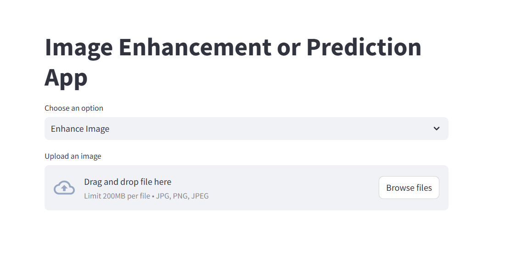

# Image Manipulation and Model Prediction App

## Project Description
This project is a Streamlit-based application for image manipulation and prediction using an decision tree model. It provides various options to enhance images, such as applying filters, adjusting brightness/contrast, and adding shapes, as well as the ability to classify images with a pre-trained Decision Tree model.

## Prerequisites
- Python 3.10 or higher.
- Install the required libraries using:
pip install -r requirements.txt

## How to Run
1. Clone the repository:
2. git clone (https://github.com/Ahmed-7-ML/Traffic-Sign-Classification.git)

## Navigate to the project directory:
cd GermanTrafficSignsClassification

## Run the application:
streamlit run app.py

## How to Use
- After launching the application:
1. Choose between **"Prediction"** or **"Enhancement"**.
2. **For Prediction**: Upload an image, and the app will classify it using the SVM model.
3. **For Enhancement**: Select one of the enhancement options, such as:
  - Apply a **Negative Filter**.
  - Adjust **Brightness/Contrast**.
  - Add **Shapes** or **Text** to the image.
  - etc.

## Screenshots

## Contributions
Contributions are welcome! Please open an issue or submit a pull request to improve the project.
